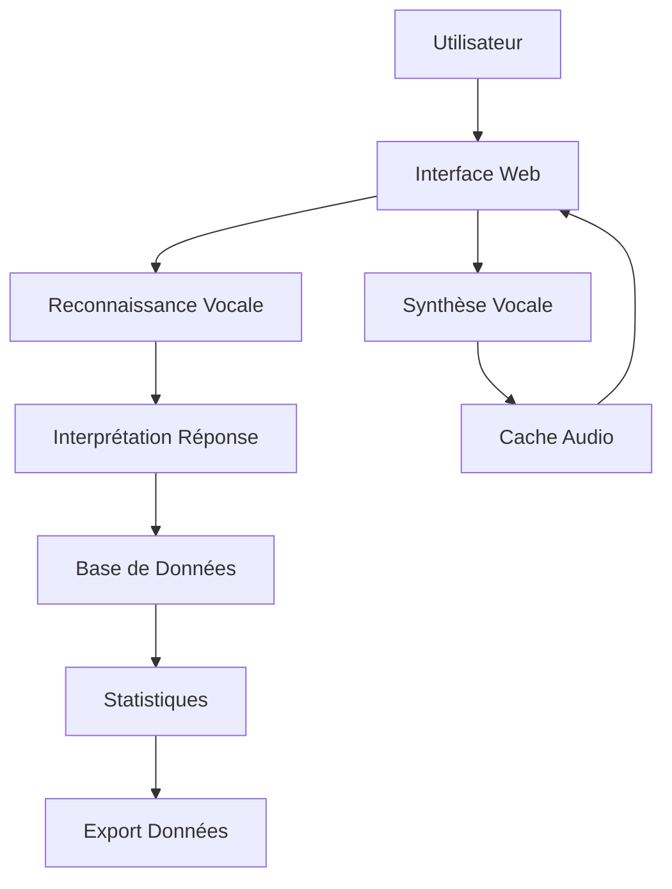

# 🏥 Questionnaire EORTC QLQ-C30 - Application Flask

[](https://python.org)
[](https://flask.palletsprojects.com)
[](LICENSE)
[](https://render.com)

> **Application web moderne pour l'évaluation de la qualité de vie des patients cancéreux avec reconnaissance vocale continue et interface accessible.**

## 📋 Table des Matières

- [🎯 Aperçu](#-aperçu)
- [✨ Fonctionnalités](#-fonctionnalités)
- [🏗️ Architecture](#️-architecture)
- [🚀 Installation](#-installation)
- [⚙️ Configuration](#️-configuration)
- [🌐 Déploiement](#-déploiement)
- [📊 API Documentation](#-api-documentation)
- [🔧 Développement](#-développement)
- [📈 Performance](#-performance)
- [🛡️ Sécurité](#️-sécurité)
- [🤝 Contribution](#-contribution)
- [📄 Licence](#-licence)

## 🎯 Aperçu

Cette application Flask implémente le questionnaire **EORTC QLQ-C30** (European Organisation for Research and Treatment of Cancer Quality of Life Questionnaire), un outil standardisé d'évaluation de la qualité de vie des patients atteints de cancer.

### 🎯 Objectifs

- **Accessibilité** : Interface optimisée pour les personnes âgées
- **Efficacité** : Reconnaissance vocale continue pour un remplissage rapide
- **Conformité** : Respect des standards EORTC et RGPD
- **Performance** : Cache audio et optimisations pour un déploiement cloud

## ✨ Fonctionnalités

### 🎤 **Reconnaissance Vocale Continue**
- **1 seul clic** pour démarrer l'écoute sur les 30 questions
- **Support multi-navigateur** : Chrome/Edge (Web Speech API) + Firefox/Safari (Fallback)
- **Interprétation intelligente** des réponses vocales
- **Arrêt automatique** de l'audio quand l'utilisateur parle

### 🔊 **Système Audio Avancé**
- **Synthèse vocale** avec Google Cloud TTS ou Gemini TTS
- **Cache audio** avec hachage MD5 pour optimiser les performances
- **Lecture automatique** des questions avec accélération 20%
- **Interface accessible** pour malvoyants

### 📊 **Gestion des Données**
- **Base SQLite** pour la persistance des données
- **Export multi-format** : JSON, CSV, Excel
- **Statistiques détaillées** de complétion
- **Anonymisation RGPD** des données personnelles

### 🎨 **Interface Utilisateur**
- **Design responsive** adaptatif mobile/desktop
- **Progression visuelle** du questionnaire
- **Feedback temps réel** de la reconnaissance vocale
- **Mode sombre/clair** selon les préférences

## 🏗️ Architecture

```
questionnaire_flask/
├── 📁 Application Core
│   ├── app_flask.py                 # Application Flask principale
│   ├── config_flask.py              # Configuration et variables d'environnement
│   └── questionnaire_logic.py      # Logique métier EORTC QLQ-C30
│
├── 📁 Data Layer
│   ├── models/
│   │   ├── database_flask.py       # Gestionnaire SQLite
│   │   └── __init__.py
│   └── data/
│       └── responses.db            # Base de données SQLite
│
├── 📁 Presentation Layer
│   ├── routes/
│   │   ├── main_flask.py           # Routes principales (UI)
│   │   ├── api_flask.py            # API REST pour AJAX
│   │   └── __init__.py
│   └── templates/
│       ├── base_flask.html         # Template de base
│       ├── accueil_flask.html      # Page d'accueil
│       ├── questionnaire_flask_simple.html  # Questionnaire principal
│       ├── resultat_flask.html     # Page de résultats
│       ├── permission_flask.html   # Tests navigateur
│       └── question0_flask.html    # Question de test
│
├── 📁 Static Assets
│   ├── static/
│   │   ├── css/
│   │   │   └── style_flask.css     # Styles CSS
│   │   ├── js/
│   │   │   ├── questionnaire_flask.js      # Logique frontend
│   │   │   └── speech_recognition_flask.js # Reconnaissance vocale
│   │   └── audio_cache/           # Cache fichiers audio TTS
│   │       └── gemini-2.5-pro-preview-tts_Achernar/
│
├── 📁 Audio Processing
│   └── audio_handler_simple_flask.py  # Gestionnaire TTS et reconnaissance
│
└── 📁 Deployment
    ├── requirements_flask.txt       # Dépendances Python
    ├── Procfile                    # Configuration Gunicorn
    ├── render.yaml                 # Configuration Render
    └── runtime.txt                 # Version Python
```

### 🔄 **Flux de Données**



## 🚀 Installation

### Prérequis

- **Python 3.11+**
- **Git**
- **Navigateur moderne** (Chrome, Firefox, Safari, Edge)

### Installation Locale

```bash
# 1. Cloner le repository
git clone https://github.com/votre-username/questionnaire-eortc-flask.git
cd questionnaire-eortc-flask

# 2. Créer un environnement virtuel
python -m venv venv
source venv/bin/activate  # Linux/Mac
# ou
venv\Scripts\activate     # Windows

# 3. Installer les dépendances
pip install -r requirements_flask.txt

# 4. Configurer les variables d'environnement
cp .env.example .env
# Éditer .env avec vos clés API

# 5. Lancer l'application
python app_flask.py
```

### Variables d'Environnement

```bash
# Configuration de base
SECRET_KEY=votre-cle-secrete-forte
FLASK_ENV=development
DEBUG=True

# API Keys (optionnelles)
GOOGLE_CLOUD_API_KEY=votre-cle-google-cloud
USE_GEMINI_TTS=False
USE_PRO_MODEL=False

# Configuration audio
AUDIO_ENABLED=True
SPEECH_LANGUAGE=fr-FR
```

## ⚙️ Configuration

### Configuration de Base

```python
# config_flask.py
class Config:
    SECRET_KEY = os.environ.get('SECRET_KEY', 'dev-secret-key')
    DATABASE_PATH = os.path.join('data', 'responses.db')
    AUDIO_CACHE_DIR = os.path.join('static', 'audio_cache')
    SPEECH_LANGUAGE = 'fr-FR'
    DEBUG = os.environ.get('FLASK_ENV') == 'development'
```

### Configuration Audio

- **Google Cloud TTS** : Synthèse vocale de haute qualité
- **Gemini TTS** : Alternative gratuite (si configurée)
- **Cache MD5** : Optimisation des performances
- **Accélération 20%** : Amélioration de l'expérience utilisateur

## 🌐 Déploiement

### Render (Recommandé)

```yaml
# render.yaml
services:
  - type: web
    name: questionnaire-eortc-flask
    env: python
    region: oregon
    plan: free
    buildCommand: pip install -r requirements_flask.txt
    startCommand: python app_flask.py
    envVars:
      - key: SECRET_KEY
        value: votre-cle-secrete
      - key: GOOGLE_CLOUD_API_KEY
        sync: false
```

### Heroku

```bash
# 1. Installer Heroku CLI
# 2. Se connecter
heroku login

# 3. Créer l'application
heroku create votre-app-name

# 4. Configurer les variables
heroku config:set SECRET_KEY=votre-cle-secrete
heroku config:set GOOGLE_CLOUD_API_KEY=votre-cle-api

# 5. Déployer
git push heroku main
```

### Docker

```dockerfile
FROM python:3.11-slim

WORKDIR /app
COPY requirements_flask.txt .
RUN pip install -r requirements_flask.txt

COPY . .
EXPOSE 5000

CMD ["python", "app_flask.py"]
```

## 📊 API Documentation

### Endpoints Principaux

#### `GET /`
Page d'accueil avec formulaire d'informations personnelles.

#### `GET /questionnaire?session_id=<id>`
Interface du questionnaire principal.

#### `GET /resultat/<session_id>`
Page de résultats avec statistiques et export.

### API REST

#### `POST /api/start_session`
```json
{
  "initials": "JD",
  "birth_date": "01/01/1990",
  "today_date": "14/10/2025",
  "audio_enabled": true,
  "mode": "Continu (Web Speech)"
}
```

#### `GET /api/get_question/<question_num>`
Récupère les détails d'une question spécifique.

#### `POST /api/process_voice`
```json
{
  "session_id": "uuid",
  "question_num": 1,
  "transcript": "beaucoup"
}
```

#### `POST /api/save_manual_response`
```json
{
  "session_id": "uuid",
  "question_num": 1,
  "score": 4,
  "response_text": "Beaucoup"
}
```

#### `GET /api/export_session/<session_id>?format=<json|csv|excel>`
Export des données de session.

### Codes de Statut

- `200` : Succès
- `400` : Requête invalide
- `404` : Session non trouvée
- `500` : Erreur serveur

## 🔧 Développement

### Structure du Code

```python
# app_flask.py - Point d'entrée principal
def create_app():
    app = Flask(__name__)
    app.config.from_object(Config)
    # Configuration CORS, sessions, etc.
    return app

# questionnaire_logic.py - Logique métier
class EORTCQuestionnaire:
    def __init__(self):
        self.questions = self._setup_questions()
    
    def get_speech_text(self, question_num: int) -> str:
        # Génération du texte pour la synthèse vocale
```

### Tests

```bash
# Tests unitaires
python -m pytest tests/

# Tests d'intégration
python test_integration.py

# Tests de reconnaissance vocale
python test_speech_recognition.py
```

### Debugging

```python
# Activer le mode debug
export FLASK_ENV=development
export DEBUG=True

# Logs détaillés
import logging
logging.basicConfig(level=logging.DEBUG)
```

## 📈 Performance

### Optimisations Implémentées

- **Cache audio MD5** : Évite la régénération des fichiers TTS
- **Compression Gzip** : Réduction de la bande passante
- **Lazy loading** : Chargement différé des ressources
- **Database indexing** : Optimisation des requêtes SQLite

### Métriques

- **Temps de réponse** : < 200ms (API)
- **Taille cache audio** : ~50MB (30 questions)
- **Mémoire utilisée** : ~100MB (production)
- **Concurrent users** : 50+ (avec Gunicorn)

### Monitoring

```python
# Health check endpoint
@app.route('/api/health')
def health_check():
    return {
        'status': 'healthy',
        'database': check_database(),
        'audio_cache': check_audio_cache(),
        'timestamp': datetime.now().isoformat()
    }
```

## 🛡️ Sécurité

### Mesures Implémentées

- **Clé secrète forte** : Génération automatique en production
- **Validation des entrées** : Sanitisation des données utilisateur
- **Protection CSRF** : Tokens de sécurité Flask
- **HTTPS obligatoire** : Redirection automatique
- **Anonymisation RGPD** : Suppression des données personnelles

### Conformité RGPD

```python
# Anonymisation des données
def anonymize_session(session_id: str):
    # Suppression des données personnelles
    # Conservation des données anonymisées pour la recherche
    pass
```

## 🤝 Contribution

### Comment Contribuer

1. **Fork** le repository
2. **Créer** une branche feature (`git checkout -b feature/nouvelle-fonctionnalite`)
3. **Commit** vos changements (`git commit -am 'Ajout nouvelle fonctionnalité'`)
4. **Push** vers la branche (`git push origin feature/nouvelle-fonctionnalite`)
5. **Créer** une Pull Request

### Standards de Code

- **PEP 8** : Style de code Python
- **Type hints** : Annotations de types
- **Docstrings** : Documentation des fonctions
- **Tests** : Couverture de code > 80%

### Issues et Bugs

Utilisez le système d'issues GitHub pour :
- 🐛 **Bug reports** : Décrivez le problème et les étapes de reproduction
- 💡 **Feature requests** : Proposez de nouvelles fonctionnalités
- 📚 **Documentation** : Améliorez la documentation

## 📄 Licence

Ce projet est sous licence **MIT**. Voir le fichier [LICENSE](LICENSE) pour plus de détails.

```
MIT License

Copyright (c) 2024 Questionnaire EORTC QLQ-C30

Permission is hereby granted, free of charge, to any person obtaining a copy
of this software and associated documentation files (the "Software"), to deal
in the Software without restriction, including without limitation the rights
to use, copy, modify, merge, publish, distribute, sublicense, and/or sell
copies of the Software, and to permit persons to whom the Software is
furnished to do so, subject to the following conditions:

The above copyright notice and this permission notice shall be included in all
copies or substantial portions of the Software.
```

---

## 📞 Support

- **Documentation** : [Wiki du projet](https://github.com/votre-username/questionnaire-eortc-flask/wiki)
- **Issues** : [GitHub Issues](https://github.com/votre-username/questionnaire-eortc-flask/issues)
- **Email** : support@votre-domaine.com

## 🙏 Remerciements

- **EORTC** pour le questionnaire QLQ-C30
- **Google Cloud** pour les API de reconnaissance vocale
- **Flask Community** pour le framework web
- **Render** pour l'hébergement cloud

---

<div align="center">

**Fait avec ❤️ pour améliorer la qualité de vie des patients**

[⬆ Retour en haut](#-questionnaire-eortc-qlq-c30---application-flask)

</div>
